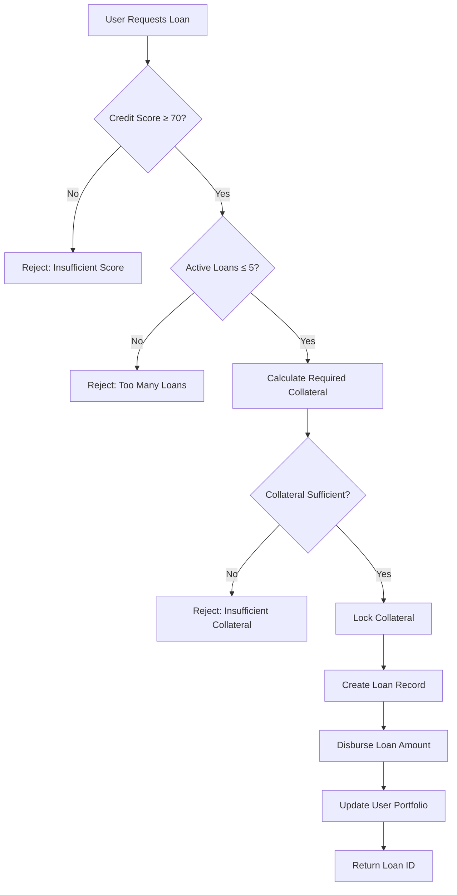
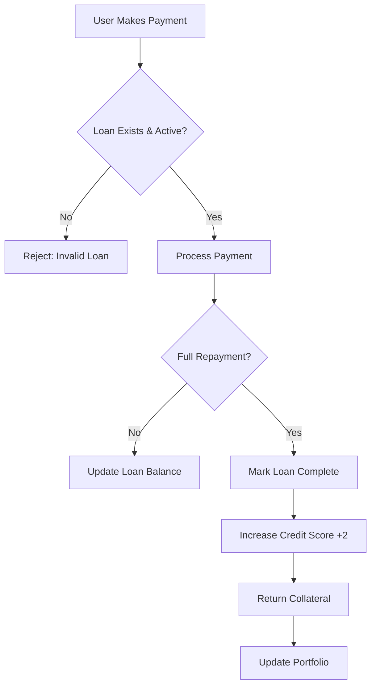
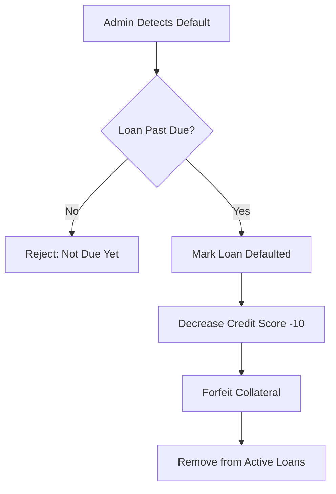

# StacksCredit - Decentralized Credit Protocol

[](https://stacks.co)
[](https://bitcoin.org)
[](LICENSE)

A trustless, Bitcoin-secured lending protocol that revolutionizes DeFi credit markets through dynamic risk assessment and collateral management on Stacks Layer 2.

## 🌟 Overview

StacksCredit is an innovative decentralized lending protocol built on Stacks that brings traditional credit mechanics to Bitcoin DeFi. The protocol features dynamic credit scoring, risk-based collateral requirements, and automated liquidation mechanisms, creating a sustainable and trustless lending ecosystem for the Bitcoin economy.

### Key Features

- **🏦 Dynamic Credit Scoring**: Build creditworthiness through successful loan repayments
- **⚡ Risk-Based Pricing**: Better rates and lower collateral for higher credit scores  
- **🔒 Bitcoin Security**: Leverages Bitcoin's security through Stacks Layer 2
- **🤖 Automated Risk Management**: Algorithmic collateral and interest rate calculations
- **📊 Transparent Operations**: All lending activities recorded on-chain
- **💰 Capital Efficient**: Up to 20 concurrent loans per user

## 🏗️ System Architecture

```
┌─────────────────────────────────────────────────────────────┐
│                    StacksCredit Protocol                    │
├─────────────────────────────────────────────────────────────┤
│  Frontend Layer (Web3 Interface)                           │
│  ├── User Dashboard                                         │
│  ├── Loan Management                                        │
│  └── Credit Score Tracking                                 │
├─────────────────────────────────────────────────────────────┤
│  Smart Contract Layer (Clarity)                            │
│  ├── Core Lending Logic                                     │
│  ├── Credit Scoring Engine                                 │
│  ├── Risk Assessment Module                                │
│  └── Collateral Management                                 │
├─────────────────────────────────────────────────────────────┤
│  Stacks Blockchain Layer                                   │
│  ├── Transaction Processing                                │
│  ├── State Management                                      │
│  └── Event Logging                                         │
├─────────────────────────────────────────────────────────────┤
│  Bitcoin Security Layer                                    │
│  ├── Consensus Mechanism                                   │
│  ├── Finality Guarantees                                  │
│  └── Network Security                                      │
└─────────────────────────────────────────────────────────────┘
```

## 📋 Contract Architecture

### Core Components

#### 1. **Data Storage Layer**
```clarity
UserScores      → Credit profiles and lending history
Loans          → Complete loan lifecycle management  
UserLoans      → Active loan portfolio tracking
```

#### 2. **Credit Scoring Engine**
- **Initial Score**: 50 (minimum starting point)
- **Score Range**: 50-100 
- **Loan Eligibility**: Minimum score of 70 required
- **Score Adjustments**: +2 for successful repayments, -10 for defaults

#### 3. **Risk Assessment Module**
```clarity
Collateral Ratio = 100 - (CreditScore × 50 / 100)
Interest Rate = 10 - (CreditScore × 5 / 100)
```

#### 4. **Loan Management System**
- **Maximum Duration**: ~1 year (52,560 blocks)
- **Concurrent Loans**: Up to 5 active loans per user
- **Loan Portfolio**: Track up to 20 total loans per user

### Function Categories

| Category | Functions | Purpose |
|----------|-----------|---------|
| **User Interface** | `initialize-score`, `request-loan`, `repay-loan` | Core user interactions |
| **Risk Calculations** | `calculate-required-collateral`, `calculate-interest-rate` | Dynamic pricing |
| **Credit Management** | `update-credit-score`, `calculate-total-due` | Credit scoring logic |
| **Data Queries** | `get-user-score`, `get-loan`, `get-user-active-loans` | Read-only access |
| **Administration** | `mark-loan-defaulted` | Protocol maintenance |

## 🔄 Data Flow

### Loan Request Flow


### Repayment Flow


### Default Processing Flow


## 🚀 Getting Started

### Prerequisites
- Stacks wallet (Hiro Wallet recommended)
- STX tokens for transactions and collateral
- Basic understanding of DeFi lending

### Installation & Deployment

1. **Clone the repository**
   ```bash
   git clone https://github.com/peter-curl/stacks-credit.git
   cd stacks-credit
   ```

2. **Install Clarinet**
   ```bash
   curl -L https://github.com/hirosystems/clarinet/releases/download/v1.8.0/clarinet-linux-x64.tar.gz | tar xz
   ```

3. **Test the contract**
   ```bash
   clarinet test
   ```

4. **Deploy to testnet**
   ```bash
   clarinet deploy --testnet
   ```

### Usage Examples

#### Initialize Credit Score
```clarity
(contract-call? .stackscredit initialize-score)
```

#### Request a Loan
```clarity
(contract-call? .stackscredit request-loan u1000000 u500000 u1440)
;; Request 1 STX loan with 0.5 STX collateral for 1440 blocks (~10 days)
```

#### Repay Loan
```clarity
(contract-call? .stackscredit repay-loan u1 u1050000)
;; Repay loan ID 1 with 1.05 STX (including interest)
```

## 📊 Protocol Mechanics

### Credit Score System
| Score Range | Interest Rate | Collateral Ratio | Loan Eligibility |
|-------------|---------------|------------------|------------------|
| 50-69       | N/A           | N/A              | ❌ Not Eligible  |
| 70-79       | 6.5-7.0%      | 65-67.5%         | ✅ Basic Terms   |
| 80-89       | 6.0-6.5%      | 60-65%           | ✅ Good Terms    |
| 90-100      | 5.0-6.0%      | 50-60%           | ✅ Best Terms    |

### Risk Parameters
- **Minimum Credit Score**: 50
- **Maximum Credit Score**: 100  
- **Loan Eligibility Threshold**: 70
- **Maximum Loan Duration**: ~1 year (52,560 blocks)
- **Score Improvement**: +2 per successful repayment
- **Default Penalty**: -10 per default

## 🔐 Security Features

- **Collateral Protection**: All loans are over-collateralized
- **Time-based Validation**: Loans have clear maturity dates
- **Admin Controls**: Protocol owner can mark overdue loans as defaulted
- **Balance Checks**: Comprehensive validation of all transfers
- **State Consistency**: Atomic operations prevent partial state updates

## 🛣️ Roadmap

- [x] Core lending functionality
- [x] Dynamic credit scoring
- [x] Risk-based pricing
- [ ] Liquidation bot integration
- [ ] Multi-asset collateral support
- [ ] Interest rate optimization
- [ ] Governance token launch
- [ ] Cross-chain expansion
